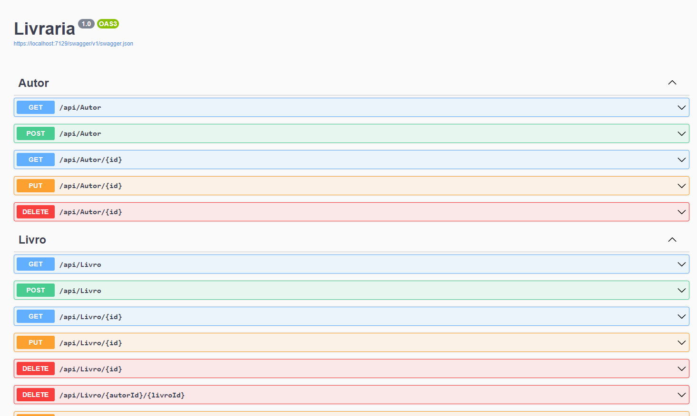
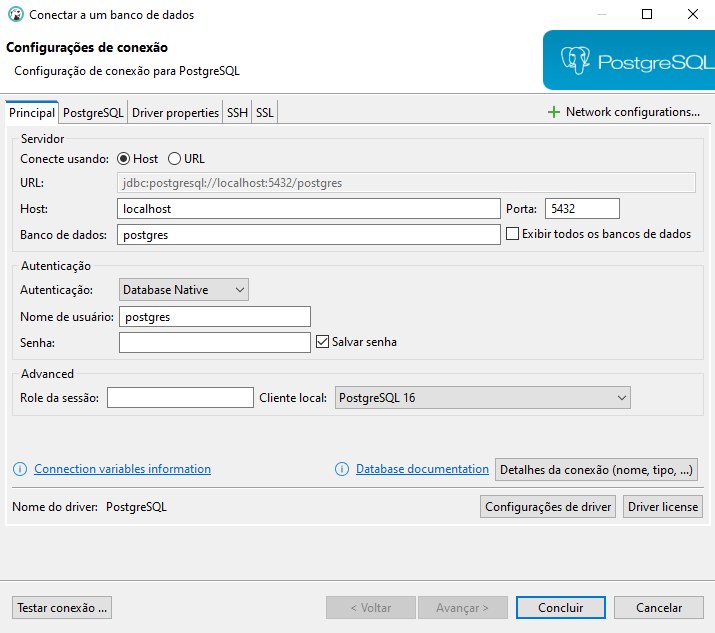

# Livraria
Projeto Livraria

#  Projeto
> O escopo do projeto consiste em desenvolver uma livraria com relação entre livro e autor!


### Tecnologias

Este projeto foi desenvolvido utilizando as seguintes tecnologia:
* [C# 12.0](https://dotnet.microsoft.com/pt-br/download/dotnet) - Linguagem de Programação do Projeto
* [.NET framework 8.0](https://dotnet.microsoft.com/pt-br/download/dotnet) - Framework Web
* [Dbeaver](https://dbeaver-io.translate.goog/download/?_x_tr_sl=en&_x_tr_tl=pt&_x_tr_hl=pt-BR&_x_tr_pto=sc) - Ferramenta para criação e gerenciamento do banco de dados
* [EntityFramework](https://learn.microsoft.com/pt-br/ef/) - API para frameworks de persistência de dados
* [Postgres](https://www.postgresql.org/) - Banco de dados
* [Unit test](https://learn.microsoft.com/pt-br/dotnet/core/testing/unit-testing-with-dotnet-test) - Ferramenta para testes
* [Swagger](https://swagger.io/) - Ferramenta para mapear e documentar as API's

## Requisitos para Compilação
## Step 1
Faça o Download do projeto:
````
git clone https://github.com/TKZI/livraria-csharp.git
cd livraria-csharp
````

## Step 2
Para o compilar e testar o projeto é necessário instalar as seguintes tecnologias:

 .Net Framework - Caso você não tenha o .Net 8.0 instalado bastar fazer o download por este link (Linux e WIndows): [Download .Net framework 8.0](https://dotnet.microsoft.com/pt-br/download/dotnet)

Postgres - Caso você não tenha o Postgres instalado basta fazer o download por este link (Linux e WIndows): [Download Postgres](https://www.postgresql.org/download/)

## Step 3
Com o .Net 8.0 e o Postgres instalado precisamos criar a Tabela no banco de dados que o projeto usa para o desenvolvimento.
Você pode criar manualmente com alguma ferramenta (Recomendo o [DBeaver](https://dbeaver.io/)).


# Comando para rodar o projeto:

### API com as funções de CRUD de livros e autores
dentro da pasta Livraria executar o seguinte comando: 
```
dotnet run
```

### Forms para cadastro e listagem de livros

dentro da pasta FormDeAutor executar o seguinte comando: 
```
dotnet run
```
obs: lembre-se que a API precisa estar rodando e o banco devidamente configurado para execução das funções pois possui vinculo entre os projetos

### Forms para cadastro e listagem de autores

dentro da pasta FormDeTestes executar o seguinte comando: 
```
dotnet run
```
obs: lembre-se que a API precisa estar rodando e o banco devidamente configurado para execução das funções pois possui vinculo entre os projetos

### Execução de testes da API
Configuração dos Testes:

Certifique-se de que as configurações de banco de dados no arquivo de configuração de testes (appsettings.Development.json ou similar) estão corretas para o ambiente de teste.

Dentro da pasta LivrariaTest executar o seguinte comando:

```
dotnet test
```
obs: lembre-se que a API precisa estar rodando e o banco devidamente configurado para execução das funções pois possui vinculo entre os projetos

# Configurações e criação do banco de dados

Vamos demonstrar com realizar a criação do banco através do Dbeaver juntamente com postgres.

## Step 1:

Crie uma conexão entre o dbeaver e o banco postgres


## Step 2:
 Após a criação da conexão crie dois bancos de dados, um para testes e outro para produção, utilize o nome **livraria** e **livraria_test** 

 **Produção:**

* Clique com o botão direito em "Databases" e selecione "Create Database".
* Nome do Banco de Dados: livraria
* Configurações adicionais conforme necessário.

**Desenvolvimento:**
* Clique com o botão direito em "Databases" e selecione "Create Database".
* Nome do Banco de Dados: livraria_test
* Configurações adicionais conforme necessário. 

 ## Step 3:
 Para facilitar a criação das tabelas, colunas e seus relacionamentos, neste projeto possui dois scrips SQL que você pode colar em um script no Dbeaver no bancos e também um script para massa de dados para testes.

 * Clique com o botão direito em livraria
 * Cliente em editor SQL
 * Abrir script SQL
 * Cole o código de **criacao-tabelas.sql** e **massa-de-dados.sql**


